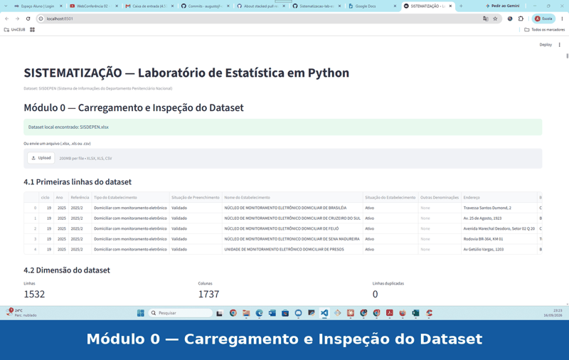

# SISTEMATIZAÇÃO — Laboratório de Estatística em Python

Trabalho da disciplina **Matemática e Estatística para Computação** (ADS - UniCEUB), sob orientação do Prof. Romes.

## Equipe

- Arthur Silas de Oliveira Costa, RA: 72601770; Augusto de Jesus Fernandes, RA:  72650179; Mateus Carvalho da Silva Vergara, RA: 72650578; Lucas Xavier Correa Rodrigues, RA: 72650473


## Demonstração da Aplicação




## Sobre o projeto

Aplicativo em Streamlit que analisa dados reais do **SISDEPEN** (Sistema de Informações do Departamento Penitenciário Nacional), implementando do zero — fazendo teste de validade comparativa com sistemas oficiais, mas sem copiá-las, somente validando os testes (numpy, pandas, statistics) — e trazendo as principais medidas estatísticas, simulações de Monte Carlo, ajuste de distribuições e regressão linear.

O trabalho traz dados que correlacionam a base de dados do sistema penitenciário nacional em percentuais e análises estatísticas correlacionadas por região.

## Estrutura do projeto

```
Sistematizacao-lab-estatistica/
├── Modulo 0/
│   ├── app.py                # Aplicativo Streamlit (interface principal)
│   ├── modulo0_dataset.py    # Script de carregamento do dataset (versão console)
│   ├── SISDEPEN.xlsx         # Dataset original
│   └── SISDEPEN.csv          # Dataset convertido
├── Modulo 1/
│   ├── statslocal.py         # Núcleo estatístico próprio
│   └── test_stats.py         # Testes do Módulo 1 (validação vs NumPy/SciPy)
├── Modulo 2/
│   ├── analise_completa.py   # Script de análise completa do dataset
│   ├── Modulo2_graficos.py   # Geração de gráficos
│   ├── colunas_dataset.txt   # Descrição/mapeamento das colunas do dataset
│   └── mapa_colunas.xlsx     # Mapa de colunas do dataset
├── Modulo 3/
│   ├── montecarlo.py         # Probabilidade e simulação de Monte Carlo
│   └── test_montecarlo.py    # Testes do Módulo 3
├── Modulo 4/
│   └── modulo4_distribuicoes_teoricas.py   # Sobreposição de curva teórica (Normal/Uniforme/Exponencial) ao histograma
├── Modulo 5/
│   └── regressao.py           # Correlação e regressão linear (dispersão, R², predição interativa)
├── Modulo 6/
│   └── RELATORIO.md          # Relatório de achados/conclusões
├── demo_frames/               # Frames e GIF de demonstração do app (README)
├── graficos/                 # Gráficos gerados pela análise exploratória (.png)
├── modulo0_dataset.py        # Script de carregamento do dataset (cópia na raiz)
├── requirements.txt
├── .gitignore
└── README.md
```

## Como rodar

```bash
# 1. Criar e ativar o ambiente virtual
python3 -m venv venv
source venv/bin/activate      # macOS/Linux
# venv\Scripts\activate     # Windows

# 2. Instalar as dependências
pip install -r requirements.txt

# 3. Rodar os testes (valida o núcleo estatístico contra NumPy/SciPy)
pytest -v

# 4. Rodar o aplicativo
streamlit run "Modulo 0/app.py"
```

## Dataset

- **Fonte:** SISDEPEN — SENAPPEN (https://www.gov.br/senappen/pt-br/servicos/sisdepen/bases-de-dados)
- 1532 linhas, muito acima do mínimo de 1000 exigido pelo enunciado
- Dezenas de variáveis numéricas e categóricas (acima do mínimo de 4 numéricas / 2 categóricas)

## Status dos módulos

- [x] Módulo 0 — Dados Reais (carregamento e inspeção do dataset)
- [x] Módulo 1 — Núcleo Estatístico Próprio (validado com testes automatizados)
- [x] Módulo 2 — Estatística Descritiva Interativa (tabela de frequências, gráficos, outliers/IQR, interpretação automática)
- [x] Módulo 3 — Probabilidade e Simulação (Lei dos Grandes Números e Teorema Central do Limite)
- [x] Módulo 4 — Distribuições Teóricas (sobreposição de curva teórica ao histograma -- Normal, Uniforme, Exponencial)
- [x] Módulo 5 — Correlação e Regressão Linear (predição interativa, R²)
- [x] Módulo 6 — Relatório de Descobertas
